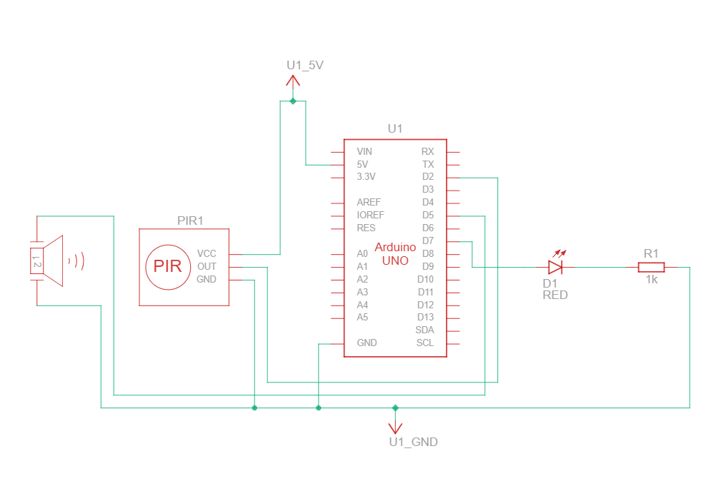
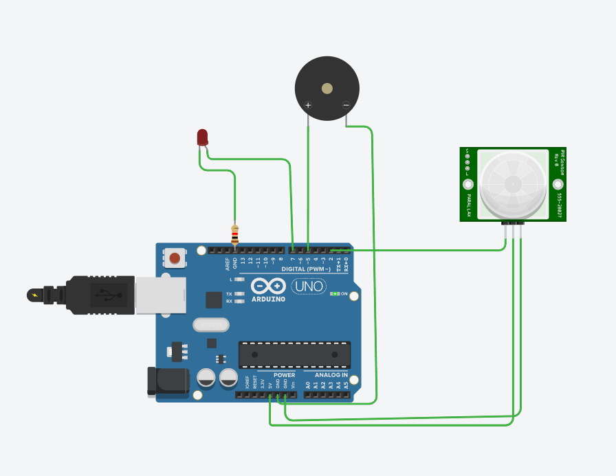

# PIR Motion Sensor Alarm with LED and Piezo Buzzer (Tinkercad Simulation)

## Description
This project uses a **PIR motion sensor** to detect movement. When motion is detected:  

- An **LED lights up**  
- A **piezo buzzer sounds**  

It’s ideal for learning Arduino programming and electronics. This setup can also be **simulated in Tinkercad** without physical components.

---


## Visual Demo

**Circuit Diagram:**  


**Simulation GIF:**  


**Simulation Video (click to play):**  
[](simulation.mp4)


## Components (Tinkercad Compatible)

- Arduino Uno  
- PIR Motion Sensor  
- LED (with 220Ω resistor)  
- Piezo buzzer (active or passive)  
- Jumper wires  
- Breadboard (optional in simulation)  

---

## Circuit Connections (Tinkercad Simulation)

| Component     | Arduino Pin | Notes                |
|---------------|-------------|--------------------|
| PIR Sensor OUT | D2          | Avoid pins 0 & 1   |
| PIR Sensor VCC | 5V          | Power              |
| PIR Sensor GND | GND         | Ground             |
| LED (+)        | D7          | Use 220Ω resistor  |
| LED (–)        | GND         | Ground             |
| Piezo (+)      | D5          | Positive terminal  |
| Piezo (–)      | GND         | Ground             |

💡 **Tinkercad Tip:** Drag and drop the PIR sensor, LED, and buzzer onto the virtual breadboard and connect them as shown.

---

## Arduino Code

```cpp
const int pinPir = 2;
const int ledPin = 7;
const int buzzerPin = 5;

void setup() {
  pinMode(ledPin, OUTPUT);
  pinMode(buzzerPin, OUTPUT);
  pinMode(pinPir, INPUT);
  Serial.begin(9600);
}

void loop() {
  int motion = digitalRead(pinPir);

  if (motion == HIGH) {
    digitalWrite(ledPin, HIGH);  // LED ON
    Serial.println("Motion detected!");

    // Beep 3 times
    for (int i = 0; i < 3; i++) {
      tone(buzzerPin, 1000, 500); // 1 kHz for 0.5 sec
      delay(600);                  // wait a bit more than tone duration
    }

  } else {
    digitalWrite(ledPin, LOW);    // LED OFF
    noTone(buzzerPin);            // Stop buzzer
    Serial.println("No motion");
  }

  delay(200); // Stabilize PIR readings
}
